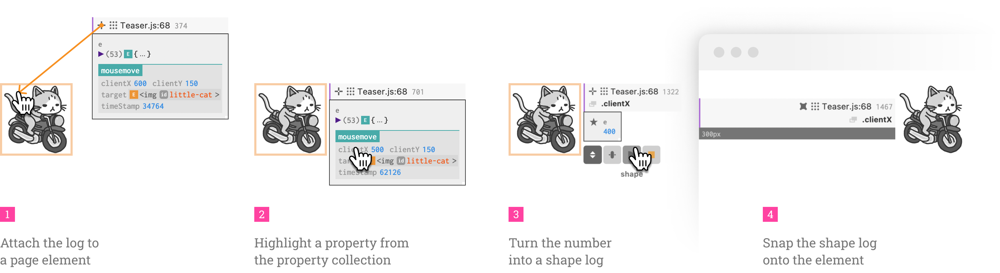
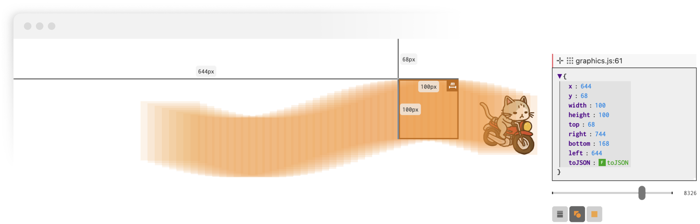

# Log-it: Supporting Programming with Interactive, Contextual, Structured, and Visual Logs



> Peiling Jiang, Fuling Sun, and Haijun Xia. 2023. Log-it: Supporting Programming with Interactive, Contextual, Structured, and Visual Logs. In _Proceedings of the 2023 CHI Conference on Human Factors in Computing Systems (CHI ’23), April 23–28, 2023, Hamburg, Germany_. ACM, New York, NY, USA, 16 pages. https://doi.org/10.1145/3544548.3581403

```bibtex
@inproceedings{jiang2023log,
  author = {Jiang, Peiling and Sun, Fuling and Xia, Haijun},
  title = {Log-It: Supporting Programming with Interactive, Contextual, Structured, and Visual Logs},
  year = {2023},
  isbn = {9781450394215},
  publisher = {Association for Computing Machinery},
  address = {New York, NY, USA},
  url = {https://doi.org/10.1145/3544548.3581403},
  doi = {10.1145/3544548.3581403},
  booktitle = {Proceedings of the 2023 CHI Conference on Human Factors in Computing Systems},
  articleno = {594},
  numpages = {16},
  keywords = {Visualization, Programming support, Program comprehension},
  location = {Hamburg, Germany},
  series = {CHI '23}
}
```

## Getting Started

To install and use the Log-it package, please follow the steps below.

First, install the NPM package.

```bash
npm install log-here-now
```

You can also manually copy the `lib` folder into your project.

Then, please install the Visual Studio Code extension, VS Log, from VS Code Marketplace, or load the package (the `vs-log/vs-log-*.vsix` file) following the steps [here](https://code.visualstudio.com/docs/editor/extension-marketplace#_install-from-a-vsix).

Now, try to log something in your JavaScript/TypeScript project.

```ts
import log from 'log-here-now'
log('Hello World')
```

You can also add the following chaining functions for the `log()` statements.

<!-- prettier-ignore -->
```ts
log(/* ... */)                      // ... [default value]
  .element(HTMLElement)             // attach to an element
  .level('log' | 'warn' | 'error')  // set the level of logs ['log']
  .id(string)                       // customize id of the stream
  .name(string)                     // customize the name of the stream
  .format('shape' | 'text')         // set format of the stream ['text']
  .unit('px' | 'rem')               // set shape log display unit ['px']
  .color(string)                    // set stream background color
  .snap(SnapOptions)                // snap to an element
  .history(number)                  // set history length for a folded stream [0]
```

Last, explore the _Streams_ of rich interactions, contexts, structures, and visuals using the graphical interface.



## File Structure

```
- src/            # source code for Log-it NPM package
  - index.ts      # entry point for the modules
  - hyperLog.ts   # typed interface for the lib
  - ...
- lib/            # compiled NPM package of Log-it
- vs-log/         # VS Log extension for VS Code
  - src/          # source code for the extension
  - vs-log-*.vsix # compiled extension ready to load
- example/        # a playground setup for exploration/testing
- labeling/       # log downloading backend for content analysis
```

## Development

Install the dependencies for local development and testing.

```bash
npm i
cd vs-log
npm i
```

Start the local server and the example environment.

```bash
npm run start
```

Build the package.

```bash
npm run build
```

Start the local server and development for the extension.

```bash
cd vs-log
npm run start
```

Build the VS Log extension.

```bash
cd vs-log
npm run build
```

## Links

- [NPM - Log-it package](https://www.npmjs.com/package/log-here-now) (`log-here-now`)
- [VS Code Marketplace - VS Log](https://marketplace.visualstudio.com/items?itemName=peiling.vs-log)

## Paper Abstract

Logging is a widely used technique for inspecting and understanding programs. However, the presentation of logs still often takes its ancient form of a linear stream of text that resides in a terminal, console, or log file. Despite its simplicity, interpreting log output is often challenging due to the large number of textual logs that lack structure and context. We conducted content analysis and expert interviews to understand the practices and challenges inherent in logging. These activities demonstrated that the current representation of logs does not provide the rich structures programmers need to interpret them or the program's behavior. We present Log-it, a logging interface that enables programmers to interactively structure and visualize logs in situ. A user study with novices and experts showed that Log-it's syntax and interface have a minimal learning curve, and the interactive representations and organizations of logs help programmers easily locate, synthesize, and understand logs.

**Learn more at https://doi.org/10.1145/3544548.3581403.**
